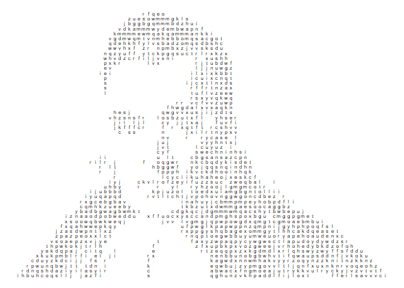

asciify
================
Danielle Navarro
11 March 2019

[](https://travis-ci.org/djnavarro/asciify)

A package to create ASCII art from arbitrary images. At the moment the documentation is more or less nonexistent.

``` r
# devtools::install_github("djnavarro/asciify")
library("asciify")
```

The core function is `ascii_map`:

``` r
bayes_img <- ascii_data("bayes.png")      # path to the bayes image
bayes_map <- ascii_map(file = bayes_img)  # construct ASCII map
bayes_map
```

    ## # A tibble: 1,404 x 3
    ##        x     y label
    ##    <int> <int> <chr>
    ##  1    44     2 r    
    ##  2    45     2 f    
    ##  3    46     2 q    
    ##  4    47     2 e    
    ##  5    48     2 o    
    ##  6    41     3 z    
    ##  7    42     3 u    
    ##  8    43     3 e    
    ##  9    44     3 s    
    ## 10    45     3 o    
    ## # ... with 1,394 more rows

There's a minimalistic plot function:

``` r
ascii_plot(bayes_map, charsize = 2)
```



You can convert to a matrix "grid" of characters:

``` r
bayes_grid <- ascii_grid(bayes_map)
str(bayes_grid)
```

    ##  chr [1:55, 1:94] " " " " " " " " " " " " " " " " " " " " " " " " " " ...

You can write this matrix to a text file using `ascii_text`

``` r
#ascii_text(bayes_grid, file = "something.txt")
```

You can also write an HTML version with a "rain" animation

``` r
#ascii_rain(bayes_grid, file = "something.html")
```

<!--
An example of the output is 

<iframe src="bayes_rain.html" width="680px", height="450px"></iframe>
-->
