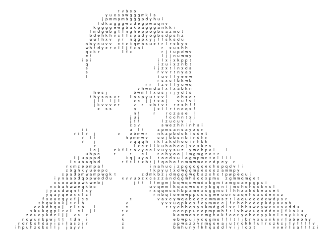

<!-- README.md is generated from README.Rmd. Please edit that file -->

# asciify

<!-- badges: start -->

[](https://travis-ci.org/djnavarro/asciify)
[](https://cran.r-project.org/package=asciify)
[](https://www.tidyverse.org/lifecycle/#experimental)
<!-- badges: end -->

A package to create ASCII art from arbitrary images. This is a work in
progress and probably doesn’t have a purpose, but I’m finding it fun.

``` r
# devtools::install_github("djnavarro/asciify")
library("asciify")
#> Registered S3 methods overwritten by 'ggplot2':
#>   method         from 
#>   [.quosures     rlang
#>   c.quosures     rlang
#>   print.quosures rlang
```

The core function in the package is `ascii_map`, which takes a path to
an image file as the input, and returns a tibble converting the image to
a character map:

``` r
bayes_img <- ascii_data("bayes.png")      # path to the bayes image
bayes_map <- ascii_map(file = bayes_img)  # construct ASCII map
bayes_map
#> # A tibble: 1,404 x 3
#>        x     y label
#>    <int> <int> <chr>
#>  1    44     2 r    
#>  2    45     2 v    
#>  3    46     2 b    
#>  4    47     2 e    
#>  5    48     2 o    
#>  6    41     3 y    
#>  7    42     3 u    
#>  8    43     3 e    
#>  9    44     3 s    
#> 10    45     3 o    
#> # … with 1,394 more rows
```

In the code chunk above `ascii_data` is just a convenience function that
returns the path to an image file that comes bundled with the package.

The tibble has three variables: `x` and `y` specify the location of a
character on a grid, and `label` specifes what character is shown at
that location. The package includes a simple plot function that returns
a ggplot:

``` r
ascii_plot(bayes_map, charsize = 2)
```



There are a few other handy functions in the package. For instance, you
can convert the tibble representation from `ascii_map` into grid of
characters using `ascii_grid`, which returns a matrix:

``` r
bayes_grid <- ascii_grid(bayes_map)
str(bayes_grid)
#>  chr [1:55, 1:94] " " " " " " " " " " " " " " " " " " " " " " " " " " ...
```

Once converted to this grid format, you can write it to text file using
`ascii_text`

``` r
#ascii_text(bayes_grid, file = "something.txt")
```

Finally, for no particularly sensible reasion, the package also allows
you to write the result to an HTML file that produces a “digital rain”
animation.

``` r
#ascii_rain(bayes_grid, file = "something.html")
```
